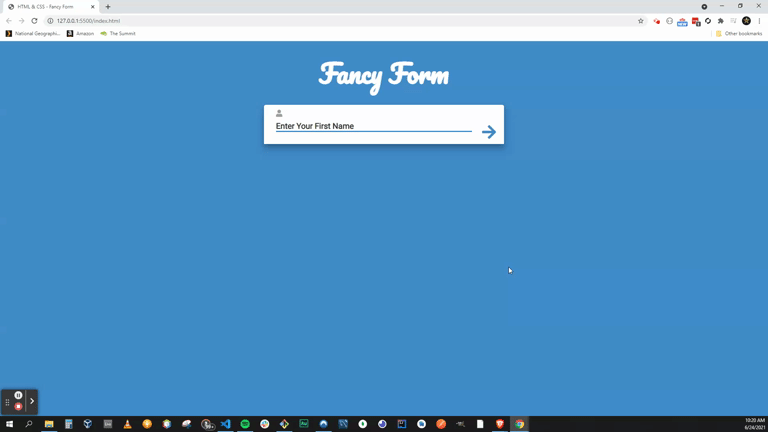

# HTML & CSS - Fancy Form

### Live Demo

https://fancyf0rm.netlify.app/



### About

On the surface, this form seems rather simple, but the intricacies of what's going on 'under the hood' are much more complex. This "Fancy Form" has some intermediate uses of error handling utilizing transition animations:

```
function inputFail() {
  formBox.className = "error";
  // repeat shake motion - set i to number of shakes
  for (let i = 0; i < 6; i++) {
    setTimeout(transform, shakeTime * i, ((i % 2) * 2 - 1) * 20, 0);
    setTimeout(transform, shakeTime * 6, 0, 0);
    inputField.focus();
  }
}

```

utilzing a transform function:

```
function transform(x, y) {
  formBox.style.transform = `translate(${x}px, ${y}px)`;
}
```

the error handling also includes email validation, albiet a very basic one - I.E.: "string@string.string":

```
const questions = [
  { question: "Enter Your First Name" },
  { question: "Enter Your Last Name" },
  { question: "Enter Your Email", pattern: /\S+@\S+\.\S+/ },
  { question: "Create A Password", type: "password" },
];

```

It has a progress bar that is dynamic based on the number of questions in our questions array:

```
progress.style.width = (position * 100) / questions.length + "%";

```

with lots of DOM manipulation to transition between questions.

```
function validate() {
  // make sure pattern matches if there is one
  if (!inputField.value.match(questions[position].pattern || /.+/)) {
    inputFail();
  } else {
    inputPass();
  }
}


```

### Acknowledgement

Thanks to Traversy Media for another amazing tutorial!
